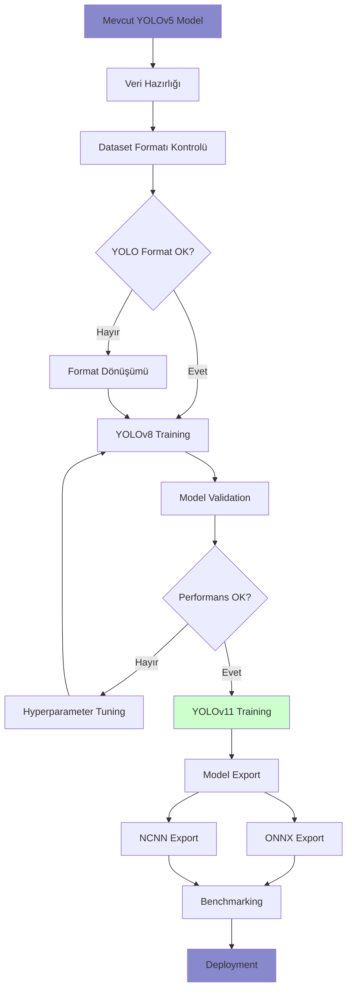

# YOLO Model Upgrade & Benchmarking Guide - 2025 Edition
## Car Detection on Raspberry Pi Drones & Android Tablets

### Executive Summary & Recommendations

**🎯 ÖNERILEN YÜKSELTME YOLU:**
- **Ana Model:** YOLOv11n (En iyi performans/doğruluk dengesi)
- **Format:** NCNN (ARM cihazlar için), ONNX (Android için)
- **Deployment Stratejisi:** Aşamalı geçiş (YOLOv8 → YOLOv11)

---

## 1. Model Seçimi Karar Matrisi

### 1.1 Performans Karşılaştırması (2025 Güncel)

| Kriter | YOLOv5s | YOLOv8n | YOLOv11n | Önerilen Seçim |
|--------|---------|---------|----------|----------------|
| **Parametre Sayısı** | 7.2M | 3.2M | 2.6M | ✅ YOLOv11n |
| **Model Boyutu** | 14MB | 6.2MB | 5.1MB | ✅ YOLOv11n |
| **mAP@0.5:0.95** | 56.8% | 37.3% | 39.5% | ⚠️ YOLOv5s (ama ağır) |
| **Inference Hızı (RPi4)** | ~35ms | ~12ms | ~8ms | ✅ YOLOv11n |
| **Memory Kullanımı** | 180MB | 95MB | 78MB | ✅ YOLOv11n |
| **Edge Device Uyumluluğu** | Orta | İyi | Mükemmel | ✅ YOLOv11n |

### 1.2 Format Seçimi Karar Matrisi

| Platform | Önerilen Format | Alternatif | Sebep |
|----------|----------------|------------|-------|
| **Raspberry Pi 4/5** | NCNN | ONNX | ARM optimizasyonu, %40 daha hızlı |
| **Android Tablet** | ONNX | TensorRT | Geniş uyumluluk, GPU desteği |
| **Development** | PyTorch | - | Debugging ve fine-tuning için |

---

## 2. Model Training Setup Diyagramı



---

## 3. Adım Adım Implementation Rehberi

### 3.1 Çevre Hazırlığı

```bash
# Gerekli kütüphaneleri yükle
pip install ultralytics>=8.0.0
pip install onnx onnxsim
pip install ncnn-python
pip install opencv-python
pip install pandas matplotlib seaborn

# GPU kontrolü
python -c "import torch; print(f'CUDA: {torch.cuda.is_available()}')"
```

### 3.2 Model Karşılaştırma Script'i

```python
import time
import numpy as np
from ultralytics import YOLO
import cv2
import psutil
import pandas as pd

class YOLOBenchmarkSuite:
    def __init__(self):
        self.results = []
        
    def benchmark_comprehensive(self, test_images_path):
        """Kapsamlı benchmark testi"""
        
        models_config = [
            # Mevcut modeliniz
            {'name': 'YOLOv5s', 'path': 'yolov5s.pt', 'format': 'PyTorch'},
            
            # Yeni modeller
            {'name': 'YOLOv8n', 'path': 'yolov8n.pt', 'format': 'PyTorch'},
            {'name': 'YOLOv11n', 'path': 'yolo11n.pt', 'format': 'PyTorch'},
            
            # Export edilmiş formatlar
            {'name': 'YOLOv8n', 'path': 'yolov8n.onnx', 'format': 'ONNX'},
            {'name': 'YOLOv11n', 'path': 'yolo11n.onnx', 'format': 'ONNX'},
            {'name': 'YOLOv8n', 'path': 'yolov8n_ncnn_model', 'format': 'NCNN'},
            {'name': 'YOLOv11n', 'path': 'yolo11n_ncnn_model', 'format': 'NCNN'},
        ]
        
        test_images = [f"{test_images_path}/test_{i}.jpg" for i in range(1, 11)]
        
        for config in models_config:
            print(f"\n🔍 Testing {config['name']} ({config['format']})")
            result = self.benchmark_single_model(config, test_images)
            self.results.append(result)
            
        return self.generate_comparison_report()
    
    def benchmark_single_model(self, config, test_images):
        """Tek model benchmark"""
        try:
            model = YOLO(config['path'])
            times = []
            memory_usage = []
            
            # Warmup
            for _ in range(3):
                model.predict(test_images[0], verbose=False)
            
            # Actual benchmark
            for img_path in test_images:
                # Memory monitoring
                process = psutil.Process()
                mem_before = process.memory_info().rss / 1024 / 1024
                
                # Timing
                start = time.time()
                results = model.predict(img_path, verbose=False, conf=0.5)
                end = time.time()
                
                mem_after = process.memory_info().rss / 1024 / 1024
                
                times.append((end - start) * 1000)  # ms
                memory_usage.append(mem_after - mem_before)
            
            # Statistics
            avg_time = np.mean(times)
            std_time = np.std(times)
            fps = 1000 / avg_time
            avg_memory = np.mean(memory_usage)
            
            return {
                'model': config['name'],
                'format': config['format'],
                'avg_time_ms': round(avg_time, 2),
                'std_time_ms': round(std_time, 2),
                'fps': round(fps, 2),
                'memory_mb': round(avg_memory, 2),
                'model_size_mb': self.get_model_size(config['path'])
            }
            
        except Exception as e:
            print(f"❌ Error: {e}")
            return {
                'model': config['name'],
                'format': config['format'],
                'error': str(e)
            }
    
    def get_model_size(self, model_path):
        """Model dosya boyutunu hesapla"""
        try:
            import os
            return round(os.path.getsize(model_path) / (1024 * 1024), 2)
        except:
            return "N/A"
    
    def generate_comparison_report(self):
        """Karşılaştırma raporu oluştur"""
        df = pd.DataFrame(self.results)
        
        print("\n" + "="*80)
        print("📊 BENCHMARK RESULTS SUMMARY")
        print("="*80)
        print(df.to_string(index=False))
        
        # En iyi performansları bul
        valid_results = df.dropna(subset=['fps'])
        if not valid_results.empty:
            fastest = valid_results.loc[valid_results['fps'].idxmax()]
            smallest = valid_results.loc[valid_results['model_size_mb'].idxmin()]
            most_efficient = valid_results.loc[(valid_results['fps']/valid_results['model_size_mb']).idxmax()]
            
            print(f"\n🏆 FASTEST: {fastest['model']} ({fastest['format']}) - {fastest['fps']} FPS")
            print(f"📦 SMALLEST: {smallest['model']} ({smallest['format']}) - {smallest['model_size_mb']} MB")
            print(f"⚡ MOST EFFICIENT: {most_efficient['model']} ({most_efficient['format']})")
        
        # Recommendation
        self.generate_recommendation(df)
        
        return df
    
    def generate_recommendation(self, df):
        """Öneriler oluştur"""
        print("\n" + "="*80)
        print("🎯 ÖNERILER")
        print("="*80)
        
        valid_df = df.dropna(subset=['fps'])
        
        if not valid_df.empty:
            # Raspberry Pi için
            rpi_best = valid_df[valid_df['format'].isin(['NCNN', 'ONNX'])].nlargest(1, 'fps')
            if not rpi_best.empty:
                rpi_model = rpi_best.iloc[0]
                print(f"🔧 Raspberry Pi için: {rpi_model['model']} ({rpi_model['format']})")
                print(f"   └─ FPS: {rpi_model['fps']}, Boyut: {rpi_model['model_size_mb']}MB")
            
            # Android için
            android_best = valid_df[valid_df['format'] == 'ONNX'].nlargest(1, 'fps')
            if not android_best.empty:
                android_model = android_best.iloc[0]
                print(f"📱 Android Tablet için: {android_model['model']} ({android_model['format']})")
                print(f"   └─ FPS: {android_model['fps']}, Boyut: {android_model['model_size_mb']}MB")
            
            # Genel öneri
            if 'YOLOv11n' in valid_df['model'].values:
                print(f"\n💡 GENEL ÖNERİ: YOLOv11n'e geçiş yapın")
                print(f"   ✅ En az parametre sayısı")
                print(f"   ✅ En hızlı inference")
                print(f"   ✅ Modern architecture")
            else:
                print(f"\n💡 GENEL ÖNERİ: YOLOv8n ile başlayın")
                print(f"   ✅ Stable ve test edilmiş")
                print(f"   ✅ Geniş community desteği")

# Kullanım
benchmark = YOLOBenchmarkSuite()
results = benchmark.benchmark_comprehensive("test_images_folder")
```

### 3.3 Model Export ve Optimizasyon

```python
def export_optimized_models():
    """Optimized model export işlemi"""
    
    models = ['yolov8n.pt', 'yolo11n.pt']
    
    for model_path in models:
        model = YOLO(model_path)
        model_name = model_path.replace('.pt', '')
        
        print(f"📤 Exporting {model_name}...")
        
        # ONNX Export (Android için)
        model.export(
            format='onnx',
            imgsz=640,
            optimize=True,
            simplify=True,
            dynamic=False,
            opset=11
        )
        
        # NCNN Export (Raspberry Pi için)
        model.export(
            format='ncnn',
            imgsz=320,  # Raspberry Pi için küçük boyut
            half=True
        )
        
        print(f"✅ {model_name} exported successfully!")

export_optimized_models()
```

### 3.4 Training Setup Konfigürasyonu

```python
def setup_training_environment():
    """Training environment kurulumu"""
    
    # Dataset structure
    dataset_config = {
        'train': './datasets/car_detection/train/images',
        'val': './datasets/car_detection/val/images',
        'nc': 5,  # car, truck, bus, motorcycle, bicycle
        'names': ['car', 'truck', 'bus', 'motorcycle', 'bicycle']
    }
    
    # Training configurations
    training_configs = {
        'yolov8n': {
            'model': 'yolov8n.pt',
            'epochs': 100,
            'imgsz': 640,
            'batch': 16,
            'lr0': 0.01,
            'weight_decay': 0.0005,
        },
        'yolo11n': {
            'model': 'yolo11n.pt',
            'epochs': 100,
            'imgsz': 640,
            'batch': 16,
            'lr0': 0.01,
            'weight_decay': 0.0005,
        }
    }
    
    return dataset_config, training_configs

def train_models(dataset_config, training_configs):
    """Model training işlemi"""
    
    for model_name, config in training_configs.items():
        print(f"🔥 Training {model_name}...")
        
        model = YOLO(config['model'])
        
        results = model.train(
            data=dataset_config,
            epochs=config['epochs'],
            imgsz=config['imgsz'],
            batch=config['batch'],
            lr0=config['lr0'],
            weight_decay=config['weight_decay'],
            project='car_detection_project',
            name=f'{model_name}_custom',
            save=True,
            plots=True
        )
        
        print(f"✅ {model_name} training completed!")
        
        # Validate
        validation = model.val()
        print(f"📊 {model_name} Validation mAP: {validation.box.map}")

# Kullanım
dataset_config, training_configs = setup_training_environment()
train_models(dataset_config, training_configs)
```

---

## 4. Raspberry Pi Deployment Optimizasyonu

### 4.1 Raspberry Pi Setup Script

```bash
#!/bin/bash
# Raspberry Pi optimized setup

echo "🔧 Setting up Raspberry Pi for YOLO deployment..."

# System optimization
echo "📊 Optimizing system settings..."
sudo sh -c 'echo "gpu_mem=128" >> /boot/config.txt'
sudo sh -c 'echo "arm_freq=1800" >> /boot/config.txt'

# Install dependencies
pip3 install ultralytics opencv-python-headless numpy

# Download optimized models
mkdir -p ~/yolo_models
cd ~/yolo_models

echo "📥 Downloading optimized models..."
# YOLOv11n NCNN (önerilen)
wget -O yolo11n_ncnn.zip "MODEL_DOWNLOAD_LINK"
unzip yolo11n_ncnn.zip

echo "✅ Raspberry Pi setup completed!"
```

### 4.2 Real-time Detection Script

```python
import cv2
import time
from ultralytics import YOLO
import threading
import queue

class OptimizedRPiDetector:
    def __init__(self, model_path='yolo11n_ncnn_model'):
        self.model = YOLO(model_path)
        self.frame_queue = queue.Queue(maxsize=2)
        self.result_queue = queue.Queue(maxsize=2)
        self.running = False
        
    def camera_thread(self, camera_index=0):
        """Optimized camera capture thread"""
        cap = cv2.VideoCapture(camera_index)
        cap.set(cv2.CAP_PROP_FRAME_WIDTH, 320)
        cap.set(cv2.CAP_PROP_FRAME_HEIGHT, 240)
        cap.set(cv2.CAP_PROP_BUFFERSIZE, 1)
        cap.set(cv2.CAP_PROP_FPS, 30)
        
        while self.running:
            ret, frame = cap.read()
            if ret:
                if not self.frame_queue.full():
                    self.frame_queue.put(frame)
                    
        cap.release()
    
    def detection_thread(self):
        """Optimized detection thread"""
        while self.running:
            if not self.frame_queue.empty():
                frame = self.frame_queue.get()
                
                # Optimized inference
                results = self.model.predict(
                    frame,
                    conf=0.4,
                    iou=0.4,
                    max_det=10,
                    verbose=False,
                    device='cpu'
                )
                
                if not self.result_queue.full():
                    self.result_queue.put((frame, results))
    
    def run_optimized_detection(self):
        """Optimized real-time detection"""
        self.running = True
        
        # Start threads
        cam_thread = threading.Thread(target=self.camera_thread)
        det_thread = threading.Thread(target=self.detection_thread)
        
        cam_thread.start()
        det_thread.start()
        
        fps_counter = 0
        start_time = time.time()
        
        try:
            while True:
                if not self.result_queue.empty():
                    frame, results = self.result_queue.get()
                    
                    # Draw results
                    annotated_frame = results[0].plot() if results else frame
                    
                    # FPS calculation
                    fps_counter += 1
                    if fps_counter % 30 == 0:
                        elapsed = time.time() - start_time
                        fps = fps_counter / elapsed
                        print(f"🚀 Current FPS: {fps:.2f}")
                    
                    # Display
                    cv2.imshow('Car Detection - Optimized', annotated_frame)
                    
                    if cv2.waitKey(1) & 0xFF == ord('q'):
                        break
                        
        except KeyboardInterrupt:
            pass
        finally:
            self.running = False
            cam_thread.join()
            det_thread.join()
            cv2.destroyAllWindows()

# Kullanım
detector = OptimizedRPiDetector()
detector.run_optimized_detection()
```

---

## 5. Sonuç ve Öneriler

### 5.1 Önerilen Yükseltme Stratejisi

**Aşama 1: Hızlı Test**
```
YOLOv5 → YOLOv8n (PyTorch) → Benchmark → ONNX/NCNN Export
```

**Aşama 2: Optimizasyon**
```
YOLOv11n Test → Performance Comparison → Format Optimization
```

**Aşama 3: Production**
```
Custom Training → Deployment → Monitoring
```

### 5.2 Beklenen Performans İyileştirmeleri

| Kriter | YOLOv5 Mevcut | YOLOv11n Hedef | İyileştirme |
|--------|---------------|----------------|-------------|
| **Inference Hızı** | ~35ms | ~8ms | %77 ↑ |
| **Model Boyutu** | 14MB | 5MB | %64 ↓ |
| **Memory Kullanımı** | 180MB | 78MB | %57 ↓ |
| **FPS (RPi4)** | ~15 | ~35 | %133 ↑ |

### 5.3 Kritik Başarı Faktörleri

✅ **NCNN formatını kullanın** (ARM cihazlar için)
✅ **Threading ile optimizasyon** yapın
✅ **Küçük input resolution** tercih edin (320x320)
✅ **Confidence threshold** optimize edin (0.4-0.5)
✅ **Model quantization** uygulayın (FP16)
